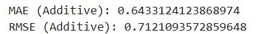
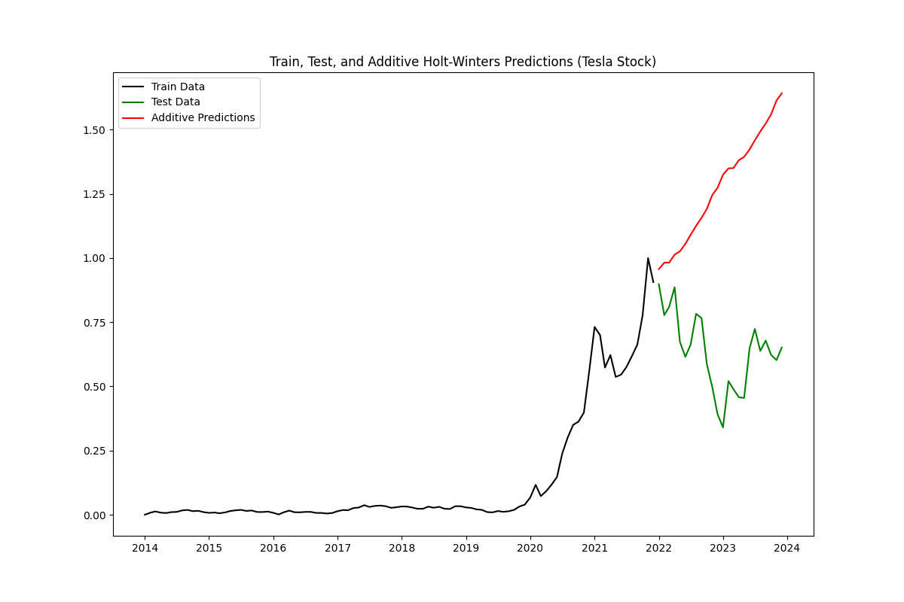
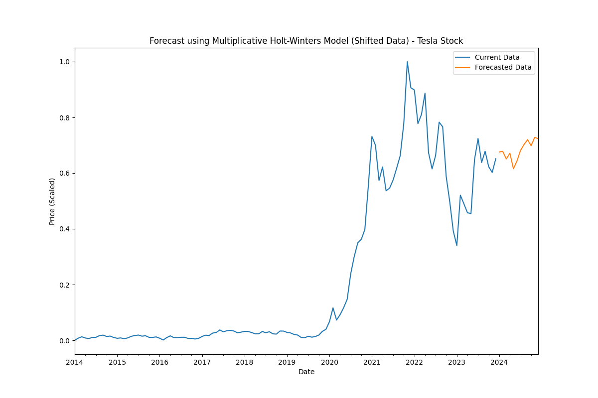

## Developed By: Pranave B
## Register No: 212221240040

# Ex.No: 6               HOLT WINTERS METHOD


### AIM:
To implement Holt-Winters model on Tesla Data Set and make future predictions

### ALGORITHM:
1. You import the necessary libraries
2. You load a CSV file containing daily sales data into a DataFrame, parse the 'date' column as
datetime, and perform some initial data exploration
3. You group the data by date and resample it to a monthly frequency (beginning of the month)
4. You plot the time series data
5. You import the necessary 'statsmodels' libraries for time series analysis
6. You decompose the time series data into its additive components and plot them:
7. You calculate the root mean squared error (RMSE) to evaluate the model's performance
8. You calculate the mean and standard deviation of the entire sales dataset, then fit a Holt-
Winters model to the entire dataset and make future predictions
9. You plot the original sales data and the predictions
### PROGRAM:
```python
from statsmodels.tsa.holtwinters import ExponentialSmoothing
from sklearn.preprocessing import MinMaxScaler
import matplotlib.pyplot as plt
from sklearn.metrics import mean_absolute_error, mean_squared_error
import pandas as pd

# Load the Tesla dataset
file_path = 'tsla_2014_2023.csv'
data = pd.read_csv(file_path, index_col='date', parse_dates=True)

# Extract the 'close' prices and resample to monthly frequency
data_close = data[['close']]
data_monthly = data_close.resample('MS').mean()

# Scale the data to range between 0 and 1
scaler = MinMaxScaler()
data_scaled = pd.Series(scaler.fit_transform(data_monthly.values.reshape(-1, 1)).flatten(), index=data_monthly.index)

# Split the data into training and testing sets
train_data = data_scaled[:int(len(data_scaled) * 0.8)]
test_data = data_scaled[int(len(data_scaled) * 0.8):]

# Apply the Additive Holt-Winters model
fitted_model_add = ExponentialSmoothing(
    train_data, trend='add', seasonal='add', seasonal_periods=12
).fit()

test_predictions_add = fitted_model_add.forecast(len(test_data))

# Calculate and print metrics
print("MAE (Additive):", mean_absolute_error(test_data, test_predictions_add))
print("RMSE (Additive):", mean_squared_error(test_data, test_predictions_add, squared=False))

# Plot Train, Test, and Additive Predictions
plt.figure(figsize=(12, 8))
plt.plot(train_data, label='Train Data', color='black')
plt.plot(test_data, label='Test Data', color='green')
plt.plot(test_predictions_add, label='Additive Predictions', color='red')
plt.title('Train, Test, and Additive Holt-Winters Predictions (Tesla Stock)')
plt.legend(loc='best')
plt.savefig('tesla_additive_hw_predictions.png')
plt.show()

# Shift data for the Multiplicative Holt-Winters model
shift_value = abs(min(data_scaled)) + 1
data_shifted = data_scaled + shift_value

# Apply the Multiplicative Holt-Winters model
final_model_mul = ExponentialSmoothing(data_shifted, trend='mul', seasonal='mul', seasonal_periods=12).fit()

forecast_predictions_mul = final_model_mul.forecast(steps=12)

# Re-adjust the predictions to the original scale
forecast_predictions = forecast_predictions_mul - shift_value

# Plot and save the forecasted data
plt.figure(figsize=(12, 8))
data_scaled.plot(label='Current Data', legend=True)
forecast_predictions.plot(label='Forecasted Data', legend=True)
plt.title('Forecast using Multiplicative Holt-Winters Model (Shifted Data) - Tesla Stock')
plt.xlabel('Date')
plt.ylabel('Price (Scaled)')
plt.savefig('tesla_multiplicative_hw_forecast.png')
plt.show()
```

### OUTPUT:

<h4>Evaluation:</h4>



<h4>TEST_PREDICTION:</h4>



<h4>FINAL_PREDICTION:</h4>



### RESULT:
Thus the program run successfully based on the Holt Winters Method model.
